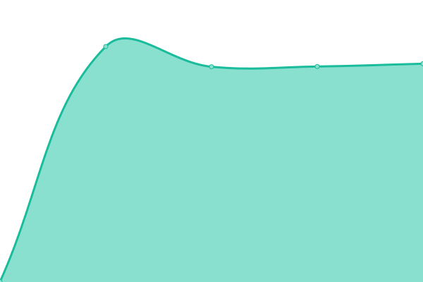
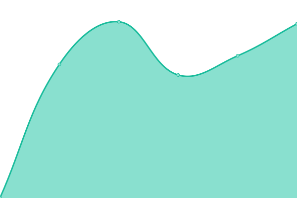

# [📈 Live Status](https://jjeaby.github.io/mew/): <!--live status--> **🟨 Partial outage**

This repository contains the open-source uptime monitor and status page for [jjeaby](https://jjeaby.github.io/mew/), powered by [Upptime](https://github.com/upptime/upptime).

With [Upptime](https://upptime.js.org), you can get your own unlimited and free uptime monitor and status page, powered entirely by a GitHub repository. We use [Issues](https://github.com/jjeaby/mew/issues) as incident reports, [Actions](https://github.com/jjeaby/mew/actions) as uptime monitors, and [Pages](https://jjeaby.github.io/mew/) for the status page.

<!--start: status pages-->
<!-- This summary is generated by Upptime (https://github.com/upptime/upptime) -->
<!-- Do not edit this manually, your changes will be overwritten -->

| URL                                     | Status  | History                                                                                       | Response Time                                                                        | Uptime                                                                                                                                                                                                           |
| --------------------------------------- | ------- | --------------------------------------------------------------------------------------------- | ------------------------------------------------------------------------------------ | ---------------------------------------------------------------------------------------------------------------------------------------------------------------------------------------------------------------- |
| [mecab jjeaby](https://mecab.jjeaby.ml) | 🟩 Up   | [mecab-jjeaby.yml](https://github.com/jjeaby/mew/commits/master/history/mecab-jjeaby.yml)     |  967ms    |    |
| [doku jjeaby](https://www.jjeaby.ml)    | 🟩 Up   | [doku-jjeaby.yml](https://github.com/jjeaby/mew/commits/master/history/doku-jjeaby.yml)       |  1165ms    |      |
| je Secret Site                          | 🟥 Down | [je-secret-site.yml](https://github.com/jjeaby/mew/commits/master/history/je-secret-site.yml) |  1278ms |  |

<!--end: status pages-->

여기 수정?

[**Visit our status website →**](https://jjeaby.github.io/mew/)

## 📄 License

- Code: [MIT](./LICENSE) © [jjeaby](https://jjeaby.github.io/mew/)
- Data in the `./history` directory: [Open Database License](https://opendatacommons.org/licenses/odbl/1-0/)
